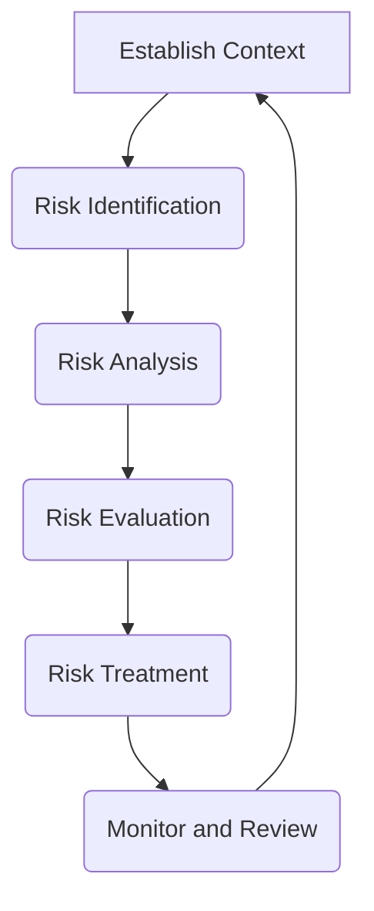

# Risk Management Plan
## Property Pride Professional Services (3PS)
Version: 2.0.0
Last Updated: 2024-12-28
Last Modified By: Documentation Team
Change Type: Major Update - Risk Framework & Governance

### Purpose Statement
This Risk Management Plan outlines the processes for identifying, assessing, and mitigating risks associated with projects and operations.

**Target Audience:** All team members, management, stakeholders
**Scope:** All risk management procedures and protocols  
**Related Documents:** 
- Emergency Response Plan [ERP-001] → Links to Emergency Protocols [KB-401-01]
- Safety Guidelines [SG-001] → Links to Safety Management [KB-401-02]
- Financial Plan [FP-001] → Links to Financial Risk [KB-031-01] 
- Operations Manual [OP-001] → Links to Operational Risk [KB-101-04]

### Risk Management Principles 🎯

#### Proactive and Integrated
- Anticipate and prevent risks where possible  
- Embed risk management in all activities
- Consider risk in decision making processes
- Promote a risk-aware culture  

#### Systematic and Structured  
- Apply a consistent risk management approach
- Use a common risk language and criteria
- Document risks and maintain risk registers  
- Communicate risk information effectively

#### Customized and Proportionate
- Tailor risk management to context and objectives  
- Allocate resources based on risk significance
- Adopt cost-effective risk mitigation measures
- Allow for flexibility and adaptability  

#### Continuous Improvement  
- Monitor and review risk management performance
- Learn from successes and failures
- Adapt to changes in internal and external context  
- Pursue opportunities for enhancement

### Risk Governance Structure 👥

#### Board of Directors
- Set risk appetite and tolerance levels  
- Approve risk management policies
- Provide oversight and guidance
- Review risk reports and ensure accountability  

#### Risk Management Committee  
- Develop and update risk management framework
- Monitor implementation and effectiveness
- Escalate significant risks and propose responses  
- Promote cross-functional coordination

#### Risk Owners  
- Identify and assess risks in their areas
- Implement and monitor risk controls
- Report on risk status and key indicators
- Participate in risk reviews and improvements  

### Risk Assessment Process 📋

#### 1. Establish Context  
- Define risk assessment objectives and scope
- Understand internal and external factors
- Set risk assessment criteria  
- Engage relevant stakeholders

#### 2. Risk Identification
- Identify sources of risk and potential impacts  
- Consider all types of risks (strategic, operational, etc.)
- Use various methods (brainstorming, checklists, etc.)
- Involve diverse perspectives  

#### 3. Risk Analysis  
- Determine likelihood and consequence of risks
- Consider inherent and residual risk levels
- Use qualitative and/or quantitative methods  
- Prioritize risks based on analysis

#### 4. Risk Evaluation
- Compare analyzed risks against risk criteria  
- Determine risk acceptability and treatment needs
- Consider risk appetite and tolerance levels
- Prioritize risks for treatment  

#### 5. Risk Treatment
- Select appropriate risk treatment options  
- Develop and implement risk treatment plans
- Assign responsibilities and resources  
- Monitor implementation and effectiveness

#### 6. Monitor and Review
- Continuously monitor risks and controls  
- Review risk management performance regularly
- Adapt to changes in context and priorities
- Identify opportunities for improvement  

### Risk Categories and Assessment 🔍

#### Strategic Risks  
1. Market Dynamics  
   - Competitor actions
   - Customer demand shifts
   - Disruptive technologies  
   - Regulatory changes

2. Business Model  
   - Value proposition relevance
   - Revenue stream sustainability
   - Cost structure efficiency  
   - Partnership dependencies

#### Operational Risks
1. Service Delivery  
   - Quality and timeliness
   - Resource availability  
   - Equipment reliability
   - Process efficiency  

2. Safety and Environment  
   - Workplace accidents
   - Hazardous materials  
   - Natural disasters
   - Environmental compliance

#### Financial Risks  
1. Liquidity and Credit
   - Cash flow management  
   - Accounts receivable
   - Debt obligations
   - Investment returns  

2. Market and Macroeconomic  
   - Interest rate fluctuations  
   - Commodity price volatility
   - Inflation and purchasing power
   - Foreign exchange exposure  

#### Compliance Risks
1. Legal and Regulatory  
   - Applicable laws and regulations
   - Contractual obligations  
   - Intellectual property rights
   - Litigation and disputes  

2. Ethics and Reputation  
   - Fraud and misconduct  
   - Conflicts of interest
   - Data privacy and security
   - Stakeholder trust and perception  

### Risk Reporting and Oversight 📊

#### Risk Reports  
1. 🔍 Risk Profile  
   - Overview of risk landscape
   - Assessment of key risks  
   - Trends and emerging issues
   - Treatment plan status

2. 🚨 Risk Indicators
   - Key risk indicator (KRI) dashboards  
   - Risk appetite and tolerance thresholds
   - Early warning signals  
   - Risk control effectiveness measures

#### Oversight Meetings
1. 🗓️ Quarterly Risk Reviews  
   - In-depth review of risk profile
   - Progress on treatment actions
   - Significant incidents and near-misses  
   - Approval of framework updates

2. 📅 Monthly Risk Committee Meetings
   - Emerging risk discussions  
   - Escalated risk decisions
   - Cross-functional coordination
   - Resource and budget needs  

### Conclusion
This Risk Management Plan provides the structure and guidance for proactively identifying, assessing, and managing risks at 3PS. By integrating risk management principles, establishing clear governance, and promoting a risk-aware culture, we can effectively navigate uncertainties and seize opportunities.  

All employees have a role to play in managing risks within their areas of responsibility, and leaders are expected to set the tone, model the right behaviors, and hold their teams accountable. Regular reviews and updates to this plan will ensure it remains fit-for-purpose in our dynamic business environment.

**Document Control:** 
- Location: DOC-016-RMP-2024 
- Access Level: Internal Use Only
- Review Cycle: Quarterly
- Document Owner: Risk Management Director
- Technical Owner: Risk Management Team
- Last Technical Review: 2024-12-28
