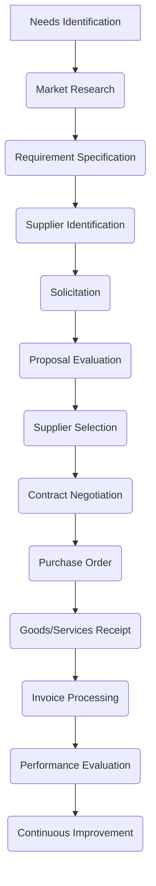

# Comprehensive Procurement Procedures Guide
## Property Pride Professional Services (3PS)
Version: 2.0.0
Last Updated: 2024-12-28

### Purpose Statement
This Comprehensive Procurement Procedures Guide establishes a standardized, transparent, and efficient approach to acquiring goods, services, and resources across Property Pride Professional Services' educational, service, and innovation domains.

**Target Audience:** Procurement staff, operations managers, budget administrators, department heads
**Scope:** All purchasing activities, resource acquisition, and supplier interactions
**Related Documents:**
- Vendor & Supplier Management Guide [VSMG-002] → Links to Supplier Relationships [KB-811-01]
- Financial Plan [FP-002] → Links to Procurement Budgeting [KB-031-02]
- Quality Standards [QS-002] → Links to Procurement Quality [KB-601-03]
- Technology Integration Guide [TIG-002] → Links to Technology Procurement [KB-201-07]

### Procurement Governance Framework

#### Core Procurement Principles
1. Transparency and Integrity
   - Ethical and unbiased procurement practices
   - Clear documentation and audit trails
   - Conflict of interest prevention
   - Consistent and fair evaluation processes

2. Value Optimization
   - Total cost of ownership approach
   - Strategic resource allocation
   - Innovation and sustainability consideration
   - Continuous improvement focus

### Procurement Process Workflow

#### Procurement Lifecycle Stages

#### 1. Needs Identification
1. Departmental Requirements
   - Comprehensive needs assessment
   - Budget alignment
   - Strategic objective validation
   - Detailed requirement documentation

2. Approval Process
   - Budget verification
   - Strategic alignment check
   - Preliminary market feasibility analysis
   - Initial authorization

#### 2. Market Research
1. Supplier Market Analysis
   - Comprehensive market scanning
   - Technology and innovation assessment
   - Sustainability capability evaluation
   - Risk and opportunity identification

2. Competitive Intelligence
   - Pricing benchmark analysis
   - Supplier capability mapping
   - Emerging technology trends
   - Innovation potential assessment

#### 3. Requirement Specification
1. Technical Specifications
   - Detailed functional requirements
   - Performance criteria
   - Quality standards
   - Compliance and certification needs

2. Evaluation Criteria Development
   - Weighted selection matrix
   - Objective assessment parameters
   - Technical and financial evaluation criteria
   - Innovation and sustainability scoring

#### 4. Supplier Identification
1. Supplier Qualification
   - Comprehensive vendor database
   - Prequalification assessment
   - Financial stability verification
   - Capability and capacity analysis

2. Diverse Supplier Inclusion
   - Local and regional supplier engagement
   - Minority and small business support
   - Sustainable and innovative suppliers
   - Strategic partnership potential

#### 5. Solicitation Process
1. Request for Proposal (RFP)
   - Comprehensive documentation
   - Clear communication of requirements
   - Transparent evaluation process
   - Detailed submission guidelines

2. Competitive Bidding
   - Open and fair competition
   - Multiple supplier engagement
   - Standardized evaluation approach
   - Confidentiality and integrity maintenance

#### 6. Proposal Evaluation
1. Technical Assessment
   - Compliance verification
   - Performance capability analysis
   - Innovation potential evaluation
   - Technical solution effectiveness

2. Financial Analysis
   - Total cost of ownership
   - Long-term value assessment
   - Risk-adjusted pricing
   - Payment terms and conditions

#### 7. Supplier Selection
1. Comprehensive Evaluation
   - Multi-dimensional scoring
   - Technical and financial weighting
   - Sustainability consideration
   - Strategic alignment assessment

2. Decision Documentation
   - Transparent selection rationale
   - Comprehensive evaluation report
   - Approval documentation
   - Feedback mechanism for non-selected vendors

#### 8. Contract Negotiation
1. Terms and Conditions
   - Clear performance expectations
   - Risk mitigation clauses
   - Sustainability requirements
   - Innovation collaboration potential

2. Legal and Compliance Review
   - Comprehensive legal verification
   - Regulatory compliance check
   - Intellectual property considerations
   - Risk assessment

#### 9. Purchase Order Management
1. Order Specification
   - Detailed delivery requirements
   - Quality assurance provisions
   - Performance metrics
   - Sustainability expectations

2. Financial Control
   - Budget alignment
   - Approval workflow
   - Payment terms
   - Financial risk management

#### 10. Performance Monitoring
1. Ongoing Evaluation
   - Continuous performance tracking
   - Quality verification
   - Delivery reliability assessment
   - Innovation contribution

2. Supplier Development
   - Feedback and improvement planning
   - Collaborative enhancement
   - Capability building
   - Strategic relationship management

### Technology Integration

#### Procurement Technology Ecosystem
1. Digital Procurement Platform
   - Automated workflow management
   - Real-time tracking and reporting
   - Integrated financial systems
   - Supplier performance dashboards

2. Analytics and Intelligence
   - Predictive procurement insights
   - Market trend analysis
   - Spend optimization
   - Risk detection mechanisms

### Sustainability and Innovation

#### Sustainable Procurement Approach
1. Environmental Considerations
   - Carbon footprint reduction
   - Circular economy principles
   - Sustainable product selection
   - Green technology prioritization

2. Social Responsibility
   - Ethical supply chain management
   - Diversity and inclusion
   - Local economic support
   - Community impact consideration

### Continuous Improvement

#### Performance Metrics and Optimization
1. Key Performance Indicators
   - Cost savings
   - Supplier performance
   - Process efficiency
   - Innovation contributions

2. Adaptive Strategy
   - Regular process review
   - Market trend integration
   - Technology evolution
   - Emerging best practices

### Appendices

#### A. Procurement Tools
1. Vendor Assessment Templates
2. RFP Documentation Frameworks
3. Evaluation Scorecards
4. Contract Templates
5. Performance Tracking Instruments

#### B. Training Resources
1. Procurement Best Practices
2. Technology Platform Guides
3. Sustainability Integration
4. Negotiation Techniques
5. Compliance Training Materials

---

*Confidential Procurement Procedures Guide*
*Property Pride Professional Services*
*Strategic Resource Optimization*

**Document Control:**
- Location: DOC-065-PPG-2024
- Access Level: Internal Use Only
- Review Cycle: Quarterly
- Document Owner: Chief Procurement Officer
- Technical Owner: Procurement Strategy Team
- Last Technical Review: 2024-12-28
