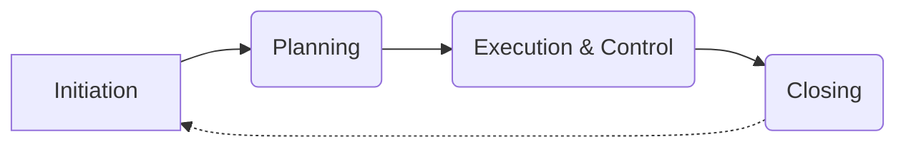

# Project Management Guide
## Property Pride Professional Services (3PS)
Version: 2.0.0 
Last Updated: 2024-12-28
Last Modified By: Documentation Team
Change Type: Major Update - Adaptive Methodologies & Knowledge Management

### Purpose Statement
This Project Management Guide provides standardized procedures for managing projects, ensuring successful delivery and alignment with organizational goals.

**Target Audience:** Project managers, team leads, operations teams, management
**Scope:** All project management procedures, protocols, and best practices
**Related Documents:**
- Operations Manual [OP-001] → Links to Project Execution [KB-101-03]
- Technology Integration Guide [TI-001] → Links to Project Systems [KB-201-02] 
- Quality Standards [QS-001] → Links to Project Quality [KB-601-02]
- Training Manual [TM-001] → Links to Project Training [KB-511-01]

### Project Management Approach 🎯

#### Adaptive Methodology Selection
1. 🚀 Agile Approach  
   - Iterative development cycles
   - Continuous stakeholder collaboration
   - Flexibility to adapt to changes  
   - Suitable for dynamic environments

2. 📈 Traditional (Waterfall) Approach
   - Linear sequential phases
   - Clearly defined requirements upfront
   - Predictable timelines and deliverables
   - Suitable for stable, well-defined projects

3. 🌐 Hybrid Approach
   - Combination of Agile and Traditional  
   - Adaptable to project specifics
   - Balances flexibility and structure
   - Suitable for projects with mixed requirements

#### Project Governance Framework 
1. 📋 Project Charter
   - Define project objectives and scope
   - Identify stakeholders and their roles
   - Establish high-level timeline and budget  
   - Secure project sponsor approval

2. 👥 Steering Committee
   - Provide strategic oversight and guidance
   - Make key decisions and resolve escalations
   - Monitor project health and progress
   - Champion project within the organization

3. 🗳️ Change Control Board
   - Assess impact of proposed changes
   - Approve or reject change requests
   - Prioritize and schedule approved changes
   - Communicate decisions to stakeholders

### Project Lifecycle 🔄

#### 1. Initiation Phase
- 🎯 Define project goals and objectives
- 🧩 Identify stakeholders and their needs  
- 📊 Develop business case and feasibility study
- 📋 Create project charter and secure approval

#### 2. Planning Phase
- 🗺️ Define project scope and requirements
- 📅 Develop project schedule and timeline
- 💰 Establish project budget and resource plan
- 🔍 Identify risks and mitigation strategies
- 📐 Define quality standards and metrics

#### 3. Execution & Control Phase  
- 👷‍♂️ Perform project work and deliver outputs
- 🔄 Monitor and control project progress
- 📈 Manage scope, schedule, cost, and quality  
- 💬 Communicate with stakeholders regularly
- 🚧 Identify and resolve issues and risks  

#### 4. Closing Phase
- 🎉 Obtain final deliverable acceptance  
- 📝 Conduct post-project review and lessons learned
- 🏁 Archive project documents and release resources
- 🤝 Transition deliverables to operational teams
- 📊 Measure project success against objectives

### Knowledge Management 📚

#### Knowledge Capture
1. 📝 Project Documentation
   - Charter and scope statement  
   - Plans and baselines
   - Status reports and meeting minutes
   - Change requests and approvals  
   - Deliverable acceptance sign-offs

2. 🧠 Tacit Knowledge Elicitation  
   - Interviews with team members
   - Lessons learned sessions
   - Best practice discussions
   - SME knowledge sharing

#### Knowledge Sharing
1. 🌐 Centralized Repository
   - Accessible by all team members  
   - Version-controlled documents
   - Searchable content
   - Secure access controls

2. 🤝 Collaboration Platforms
   - Discussion forums  
   - Wikis and knowledge bases
   - Real-time chat and conferencing
   - Social networking tools

#### Continuous Improvement  
1. 🔄 Retrospectives and Reviews
   - Regular project reflections
   - Identify successes and challenges  
   - Discuss improvement opportunities
   - Implement actionable enhancements

2. 💡 Innovation and Experimentation
   - Encourage new ideas and approaches  
   - Pilot innovative techniques and tools
   - Measure impact and value
   - Scale successful innovations  

### Conclusion
This Project Management Methodology Guide provides a flexible yet structured approach to managing projects effectively at 3PS. By selecting the appropriate methodology based on project characteristics, following a well-defined lifecycle, and integrating knowledge management practices, we can consistently deliver successful outcomes while fostering continuous improvement.

Project managers and teams are expected to adapt this guide to the specific needs of their projects while adhering to the core principles and governance framework outlined herein. Regular reviews and updates to this guide will ensure it remains aligned with organizational goals and industry best practices.

**Document Control:**
- Location: DOC-XXX-PMG-2024
- Access Level: Internal Use Only
- Review Cycle: Annually
- Document Owner: Project Management Director
- Technical Owner: Project Management Team
- Last Technical Review: 2024-12-28
