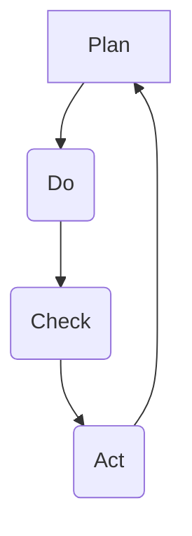

# Quality Standards
## Property Pride Professional Services (3PS)
Version: 2.0.0 
Last Updated: 2024-12-28
Last Modified By: Documentation Team
Change Type: Major Update - Service Excellence & Technology Integration

### Purpose Statement
This Quality Standards document outlines the quality assurance processes and standards to ensure that all products and services meet the required quality benchmarks.

**Target Audience:** All team members, supervisors, quality control staff  
**Scope:** All service operations and deliverables
**Related Documents:**
- Operations Manual [OP-001] → Links to Operational Quality [KB-601-01]
- Service Catalog [SC-001] → Links to Service Standards [KB-601-02] 
- Training Manual [TM-001] → Links to Quality Training [KB-511-04]

### Quality Management Principles 🎯

#### Customer Focus  
- Understand customer needs and expectations
- Align organizational objectives with customer satisfaction
- Measure and monitor customer perceptions  
- Foster customer relationships and loyalty

#### Leadership Commitment
- Establish unity of purpose and direction  
- Create an environment for people to excel
- Engage, empower, and recognize contributions
- Ensure availability of necessary resources

#### Process Approach  
- Define interconnected processes as a system
- Establish clear responsibilities and authorities
- Manage processes to achieve consistent results  
- Focus on factors like resources, methods, and metrics

#### Continuous Improvement
- Pursue incremental and breakthrough improvements  
- Provide people with training and tools to improve
- Track progress using metrics and reviews  
- Recognize and acknowledge enhancements

### Service Excellence Framework 🌟

#### Core Service Quality Dimensions
1. 💼 Professionalism 
   - Competence and expertise
   - Reliability and responsiveness  
   - Appearance and courtesy
   - Effective communication

2. ⏰ Timeliness
   - Adherence to schedules and deadlines  
   - Prompt issue resolution
   - Proactive status updates
   - Efficient service delivery  

3. 🔧 Technical Proficiency
   - Adherence to specifications and standards
   - Accuracy and precision  
   - Innovation and continuous improvement
   - Knowledge application  

4. 🤝 Customer Experience  
   - Understanding unique needs
   - Customized solutions
   - Proactive support and guidance
   - Responsive issue resolution

#### Quality Assurance Processes
1. 🎯 Quality Planning
   - Define quality standards and criteria  
   - Establish verification and validation plans
   - Identify resource and training needs  
   - Assign roles and responsibilities

2. 🔍 Quality Control  
   - Perform inspections and tests
   - Identify and document defects
   - Verify corrective actions  
   - Report quality metrics and trends

3. 🔄 Quality Improvement
   - Conduct root cause analysis of issues  
   - Implement preventive measures
   - Pursue opportunities for enhancement
   - Update standards and processes  

### Technology Integration 💻

#### Knowledge Multiplication System™
- Capture and share best practices  
- Access collective expertise and insights
- Automate quality control processes
- Analyze performance data for trends

#### Advanced Quality Tools  
- Statistical process control (SPC)
- Failure mode and effects analysis (FMEA) 
- Design of experiments (DOE)
- Lean Six Sigma methodologies

### Continuous Improvement Cycle 🔄 

#### PDCA Phases
1. 📋 Plan
   - Identify improvement opportunities  
   - Define objectives and success criteria
   - Develop action plan and allocate resources
   - Establish performance metrics  

2. 👟 Do  
   - Implement planned improvements
   - Collect data and monitor progress
   - Document observations and learnings  
   - Provide training and support

3. 🔎 Check
   - Analyze data and measure against objectives  
   - Identify gaps and areas for refinement
   - Validate effectiveness of improvements
   - Capture lessons learned  

4. 🎬 Act
   - Standardize successful improvements  
   - Communicate changes to stakeholders
   - Identify next improvement priorities
   - Launch new PDCA cycle  

### Conclusion
These Quality Standards provide the foundation for service excellence and continuous improvement at 3PS. By integrating quality management principles, technology enablers, and a robust PDCA cycle, we can consistently meet and exceed customer expectations while optimizing our operations.  

All team members are expected to understand and apply these standards in their daily work, and actively participate in ongoing quality initiatives. Leaders shall foster a culture of quality, empower their teams, and recognize outstanding contributions. Regular reviews and updates will ensure our Quality Standards remain effective and aligned with evolving business needs.

**Document Control:**
- Location: DOC-007-QS-2024
- Access Level: Internal Use Only 
- Review Cycle: Quarterly
- Document Owner: Quality Director
- Technical Owner: Quality Management Team
- Last Technical Review: 2024-12-28
